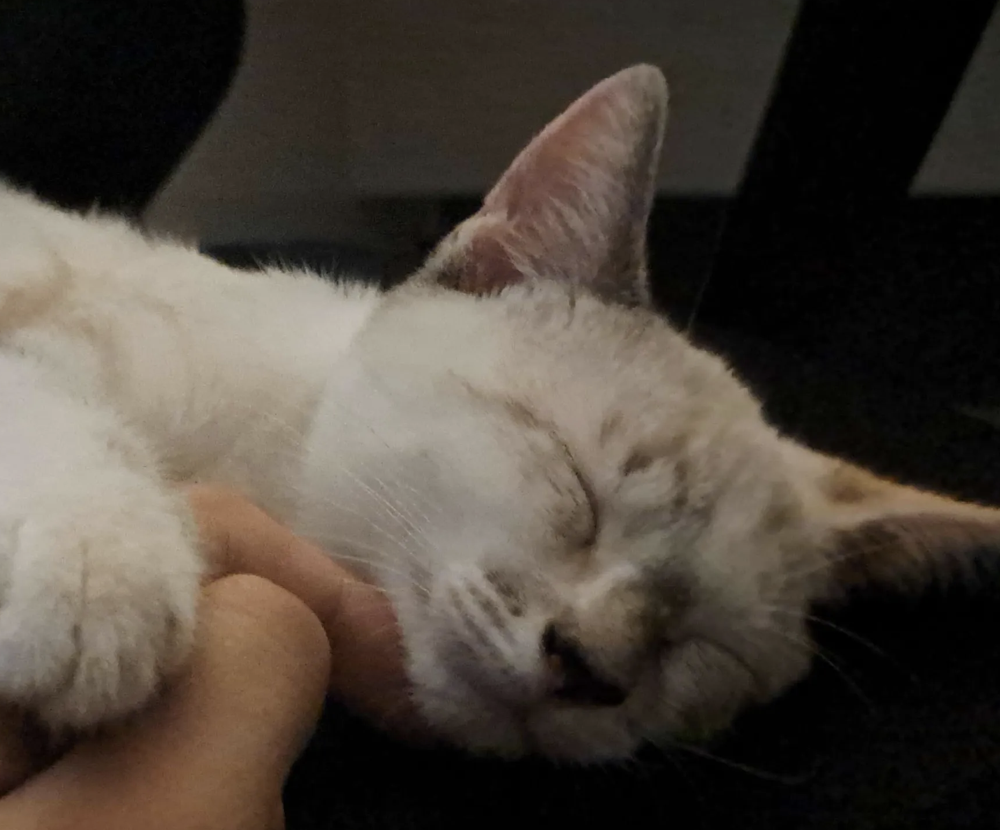

<samp>

    🎹+🐱 SynthCat MVP

## Table of Contents

1. [**Goal & Purpose**](#goal--purpose)
2. [**Installation Guide**](#installation-guide)
3. [**Roadmap**](#roadmap)
   - [Setup & Tooling](#setup--tooling)
   - [UI/UX Design](#uiux-design)
   - [Core Features](#core-features)
   - [Platform Tests](#platform-tests)
4. [**Development Guide**](#development-guide)

## Goal & Purpose

- **Goal** Develop a cross-platform forum application.
- **Tech Stack**:
  - **Language** Rust
  - **Framework** Dioxus (for UI across platform)
  - **Platforms** Mobile (iOS & Android), Web, Desktp
- **Purpose** Test Dioxus's capabilities, especially for mobile development :>

## Installation Guide

To run the SynthCat project locally follow these steps, follow these steps:

1. **Install Rust**: Follow [the official Rust installation guide](https://www.rust-lang.org/tools/install) to install Rust on your system.
2. **Install Dioxus CLI**: Install the Dioxus CLI through their [official documentation](https://dioxuslabs.com/learn/0.6/getting_started).
3. **Clone the Project**: Clone the repository to your local machine using Git: `git clone https://github.com/Coletivo-Anarquista-Trans/forum`

# Roadmap

### Setup & Tooling
- [ ] Install and configure Dioxus CLI.
- [ ] Set up dev environments
  - [ ] Web
  - [ ] Desktop
  - [ ] Mobile (IOS / I (Sofia) have a MacOS so I think I can build it + Android)
- [ ] Enable hot reloading and debugging tools.

### UI/UX Design
- [ ] Design responsive layouts
- [ ] Try to create a theme that meets the main website, so we can test if it has all the styling things that we need to create the website.
- [ ] Ensure accessibility!! (I think that it's really important)

### Core Features
- [ ] User Authentication
  - [ ] Sign up / Login
  - [ ] User profiles
- [ ] Forum System
  - [ ] CRUD posts
  - [ ] Comments
  - [ ] Tags & categories
- [ ] Real-time updates (WebSockets / This is really important just to make it more interactive, them a normal forum :c)

### Platform Tests
- [ ] Mobile
  - [ ] Touch interaction
  - [ ] Test screen sizes + Theme if it renders in a good way
  - [ ] Test Permissions and features that mobile can do
- [ ] Desktop
  - [ ] System notifications? Idk i'm not sure about what to test in desktop :P rn.

# Development Guide

- Follow [conventional commits](https://www.conventionalcommits.org/en/v1.0.0/) for all commits.

### For the future

- Every change starts with an issue.
- Create a branch from main using the format: `name/feature-name`, e.g, `sofia/potion-maker-ui`
- PRs must be linked to an issue.
- Use squash merge with the name of the branch (that should a commit message)
- Open draft PRs early to get feedback.
- Keep PRs small and focused.
- Document all public functions, modules and APIs.
- All tests and checks must pass before merging.
- No merges without review.

# Azulejo

This is a picture of the best cat. Her name is Azulejo.

</samp>

